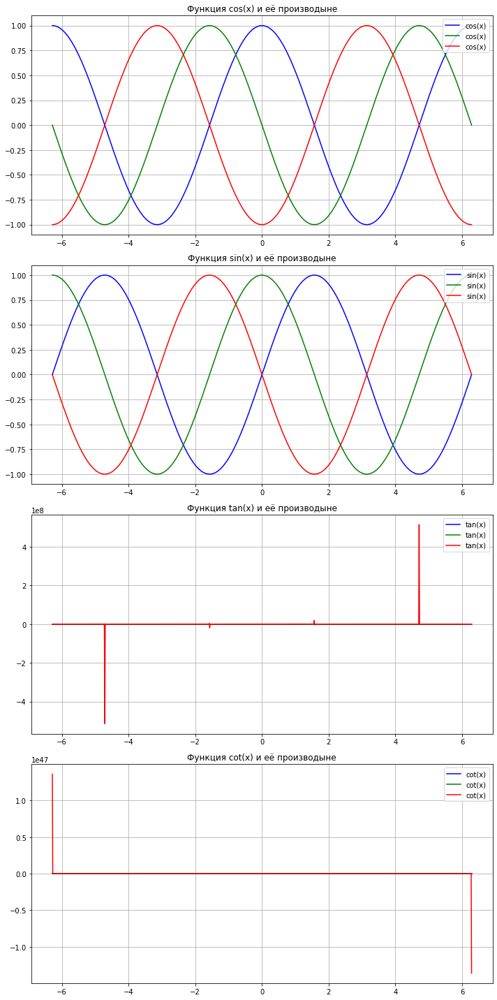

# Практическая работа №12

## Обыкновенные дифференциальные уравнения

#### Найти первую и вторую производные, а таже построить график функции, первой и второй ее производных для cos(x), sin(x), tg(x), ctg(x)


```python
import numpy as np
import matplotlib.pyplot as plt
from sympy import symbols, diff, cos, sin, tan, cot
from sympy.utilities.lambdify import lambdify

x = symbols('x')
functions = {
    "cos(x)": cos(x),
    "sin(x)": sin(x),
    "tan(x)": tan(x),
    "cot(x)": 1 / tan(x),
}

x_vals = np.linspace(-2 * np.pi, 2 * np.pi, 1000)

fig, axs = plt.subplots(4, 1, figsize = (10, 20))

for i, (name, func) in enumerate(functions.items()):
    first_derivative = diff(func, x)
    second_derivative = diff(first_derivative, x)
    
    # Преобразование
    func_lambdified = lambdify(x, func, "numpy")
    first_derivative_lambdified = lambdify(x, first_derivative, "numpy")
    second_derivative_lambdified = lambdify(x, second_derivative, "numpy")
    
    #Вычисление значений
    y_vals = func_lambdified(x_vals)
    y_first_derivative = first_derivative_lambdified(x_vals)
    y_second_derivative = second_derivative_lambdified(x_vals)
    
    #Графики
    axs[i].plot(x_vals, y_vals, label=f'{name}', color='blue')
    axs[i].plot(x_vals, y_first_derivative, label=f'{name}', color='green')
    axs[i].plot(x_vals, y_second_derivative, label=f'{name}', color='red')
    axs[i].set_title(f"Функция {name} и её производыне")
    axs[i].legend(loc="upper right")
    axs[i].grid(True)
    
plt.tight_layout()
plt.show()
```


    

    


```python

```
