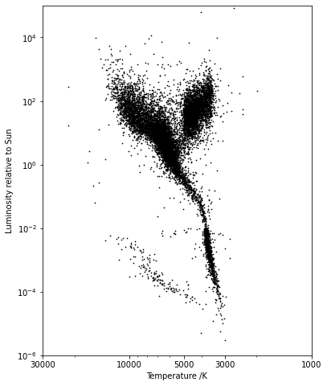
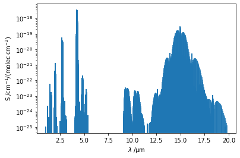

# Практическая работа №15

## Задание 1


```python
import pandas as pd
import matplotlib.pyplot as plt
from matplotlib.ticker import ScalarFormatter

# Read in data and calculate stellar temperature from the Ballesteros formula.
df = pd.read_csv('hygdata_v3-abridged.csv')
df['T'] = 4600 * (1/(0.92*df['ci'] + 1.7) + 1/(0.92*df['ci'] + 0.62))

# Set the aspect ratio for maximum clarity.
DPI = 100
width, height = 600, 800
fig, ax = plt.subplots(figsize=(width/DPI, height/DPI))
# Log-log plot with suitable ticks and labels.
ax.scatter(df['T'], df['lum'], s=0.5, c='k')
ax.set_yscale('log')
ax.set_xscale('log')
ax.set_ylim(1.e-6, 1.e5)
ax.set_xlim(30000,1000)
ax.set_xticks([30000, 10000, 5000, 3000, 1000])
# The chosen xticks don't get used unless we explicitly set a ScalarFormatter.
ax.get_xaxis().set_major_formatter(ScalarFormatter())
ax.set_xlabel('Temperature /K')
ax.set_ylabel('Luminosity relative to Sun')

plt.show()

```


    

    


## Задание 2


```python
import pandas as pd
import matplotlib.pyplot as plt

df = pd.read_fwf('CO2-transitions.par', colspecs=[(3, 15), (15, 25)],
                 header=None, names=['nu', 'S'])
df['lambda /um'] = 1.e4 / df['nu']

fig, ax = plt.subplots()
ax.stem(df['lambda /um'], df['S'], use_line_collection=True, markerfmt='none')
ax.set_yscale('log')
ax.set_xlabel('$\lambda\;/\mathrm{\mu m}$')
ax.set_ylabel('S /$\mathrm{cm^{-1}/(molec\,cm^{-2})}$')
plt.show()

```


    

    


```python

```
